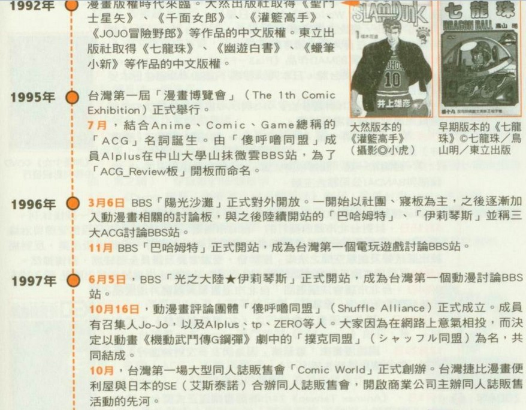
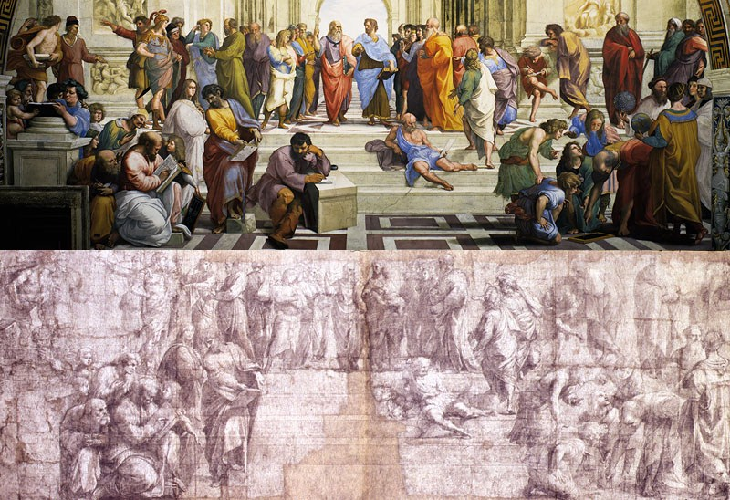
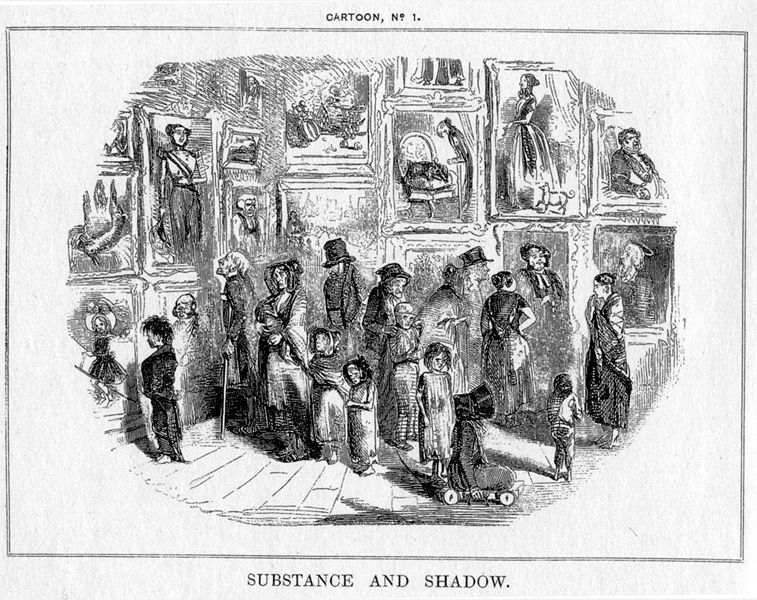
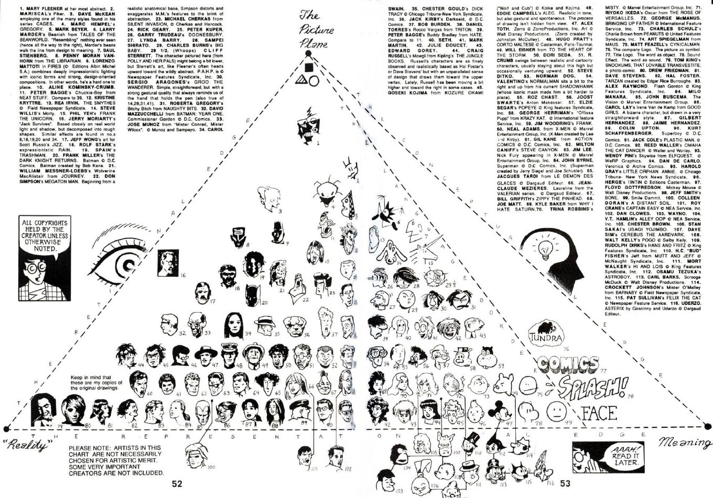
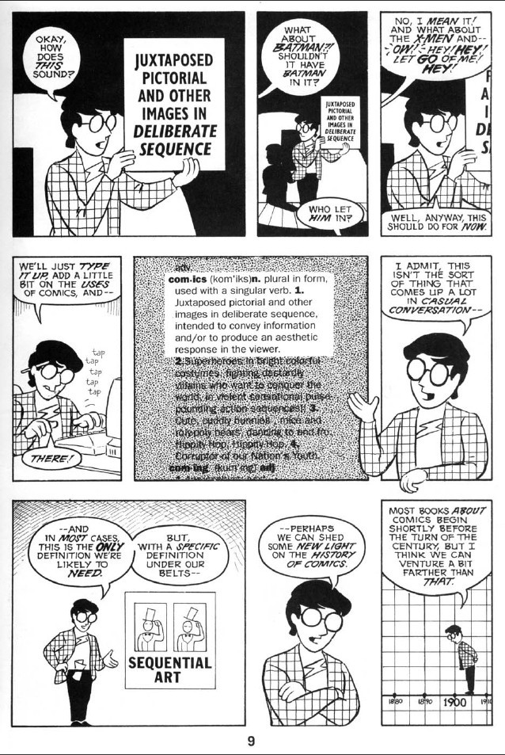
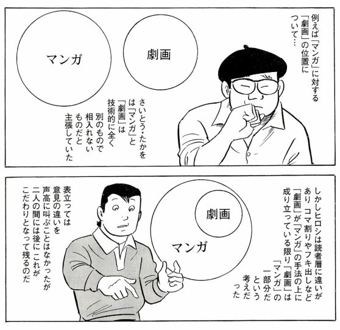
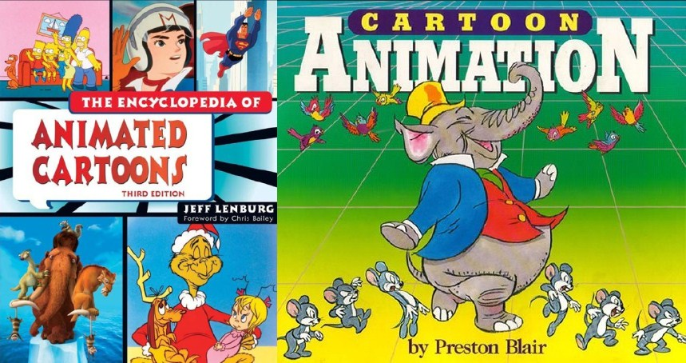
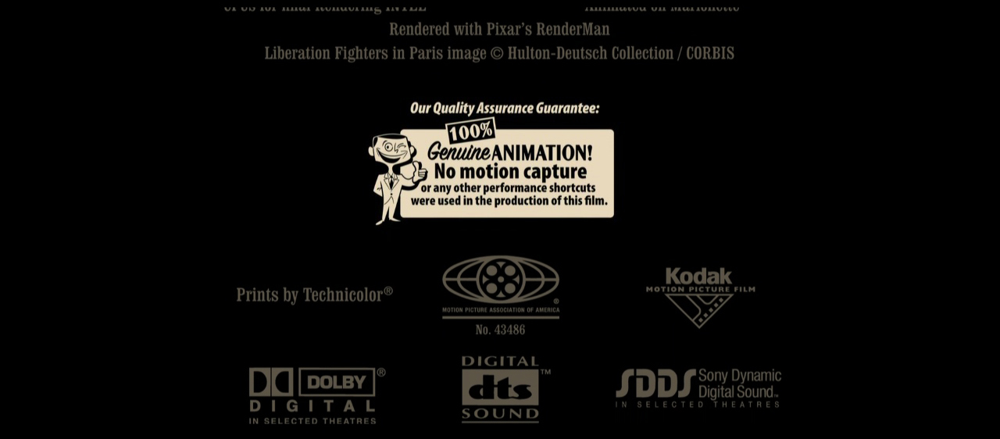
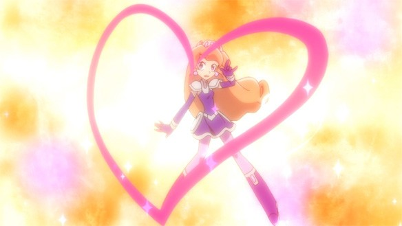
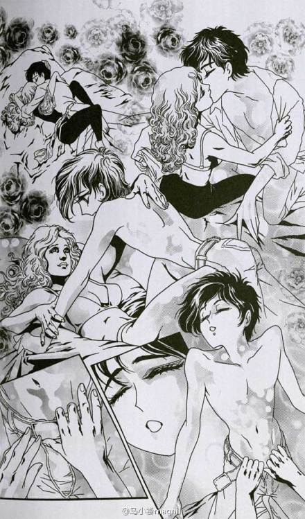

#当我们讨论动漫时我们在讨论什么#

前不久国家查处一些动画期刊，《喜羊羊》、《熊出没》的风波闹得沸沸扬扬，奥飞、华强等动画公司联合倡议行业自律，一时间有关分级的讨论不绝于耳。不过这里我们要说的还不是分级，而是另一个件事：在此次风波的背后，许多动漫爱好者、宅，或者说二次元，发表了类似“[动漫不是卡通，动漫一点也不低幼](http://weibo.com/2702735507/Ac8oGcqtD)”的观点。这涉及到一个最基本的问题——动漫，它到底是什么？

“动漫”一词的出处，有一说认为源自《动漫时代》杂志，在《漫友》的影响力之下传开。在最初，这个词的含义是将动画与漫画结合发展的产业概念，但是在现在，越来越多的新一代动画迷将其视为“日本动画”、“日本动画+漫画”的概念，甚至作为一种风格，将其等同于卡通。然而也有人将其作为“动画”或“漫画”的代名词，这使得我们在日常生活中使用该词时，无可避免的出现沟通上的障碍。

与动漫类似的，还有一个词叫“ACG”，许多培训机构及学校老师在否认动漫一词的同时却使用 ACG，并误认其是从日本或欧美传入，都是不正确的。ACG 这一缩写只在华语圈存在，而且具体由哪三个词构成也存在着疑问。

能查到最早的 ACG 一词记录源自台湾[傻呼噜同盟](http://zh.wikipedia.org/wiki/%E5%82%BB%E5%91%BC%E5%9A%95%E5%90%8C%E7%9B%9F)编撰的《台湾阿宅启示录》（《阿宅，你已经死了》的台版附录），[ccsx](http://ccsx.tw/) 所撰写的《台湾阿宅大事记》一文中指出，该词由 1995 年台湾动漫爱好者为国立中山大学山抹微云 BBS 站开设新版块而想出的缩写命名，由 Anime（动画）、Comic（漫画）、Game（游戏）三词取首字母而成，后经由傻呼噜同盟的推广下在华语圈扩散开来，如随后香港的方墨山（Format ACG，00 年成立）。在我最初上网还在腾讯论坛当版主那会儿（01 年），ACG 这个词从来没见过，大约是 02 年左右才看到，04-05 大概是个爆发期，具体何时流行开尚不清楚。

这是最初 ACG 一词所代表的含义。但[日文维基](http://ja.wikipedia.org/wiki/ACG)和[英文维基](http://en.wikipedia.org/wiki/ACG)以及这一说法有着少许出入——虽然都写道这是华语圈的用语，但三个单词的写法不同。我们写的是“Anime, Comic, Game”，日文维基写的是“Animation, Comic, Game”，而英文维基写着“Anime, Comics, Games”。注意，正是这细微的差别，可能会带来对 ACG 一词不同的理解。具体的原因我们后面会提到。

日语中相似的词只有一个——[MAG（マグ）](http://ja.wikipedia.org/wiki/MAG)。这个词是由 Manga（マンガ）、Anime（アニメ）、Game（ゲーム）三词取首字母缩合而成，但虽有该说法，使用频率却远低于华语圈的 ACG 概念。如 NHK 曾制作播出的“MAG·ネット”节目，这里的“MAG”就是上述缩写，是一档面向漫画、动画、游戏及相关亚文化的情报、访谈节目。

##卡通篇##

###卡通的原意###

关于 cartoon 一词的意思，英国的几本权威词典有着稍有出入、但是意思大致相同的解释。如[牛津高阶英语词典](http://oald8.oxfordlearnersdictionaries.com/dictionary/cartoon)、[朗文当代高级英语辞典](http://www.ldoceonline.com/dictionary/cartoon)等，其中写道：

1. （名词）尺寸与成作相等的初步素描，用于湿壁画、壁毯等作品的创作过程之中；
2. （名词）刊登在报纸、杂志之上，具有幽默、讽刺性质的画，通常与人物、时事、政治有关；
3. （名词）= comic strip，即（报纸）连环漫画；
4. （名词）= animated cartoon，即动画片；

好多释义！咋一看有些让人发晕，但其实很简单。我们按数字顺序看下来，这里是存在着一条时间线的。

1 所代表的即卡通一词的原意，语源出自法语中的 carton 或者意大利语中的 cartone，是一种大而厚重的硬纸板。当时[湿壁画](http://zh.wikipedia.org/zh-cn/%E6%BF%95%E5%A3%81%E7%95%AB)由于颜色一旦被吸入灰泥后难以修改，对绘画者的要求很高。人们为了避免出错，会在绘制之前使用同等大小的硬纸板描绘草图。此后，这类为了美术创作而绘制的初步草图则被称之为“卡通”。从十六世纪直至十九世纪中叶，这都是卡通的唯一含义。

（注：图片引自[此处](http://learn.columbia.edu/raphael/htm/raphael_athens_cartoon.htm)）

到了 1843 年，著名的杂志《[笨拙](http://en.wikipedia.org/wiki/Punch_magazine)》（Punch）上刊登了一副著名的政治讽刺画，[庄李治](http://en.wikipedia.org/wiki/John_Leech_%28caricaturist%29)（John Leech）绘制了一张题为《Cartoon no.1: Substance and Shadow》的画用以讽刺当年英国政府的铺张奢华——当时，威斯敏斯特宫在火灾后需要重建，而政府鼓励艺术家们绘制大量的初步素描，或者叫卡通，以供挑选出新的绘画和壁画作品。我们可以看到，其实庄李治标题中卡通的本意依然是前面说的初步素描，然而随后卡通一词被沿用成为讽刺政府的系列讽刺画，之后更进一步演化，用来指代类似的讽刺画们（即词意 2），可以说是一个美丽的误会吧。

之后的事情就清晰了。随着幽默、讽刺画的发展，逐渐出现了文字框和分格，连环漫画随之出现，即 3；而后由于早期动画在风格上与讽刺画、连环漫画的相似，动画也开始被称之为卡通，即 4。

而[美国传统英语词典](http://ahdictionary.com/word/search.html?q=cartoon)、[韦氏大学词典](http://www.merriam-webster.com/dictionary/cartoon)等美国词典中除了上述四层含义以外，还有另外三层解释：

1. （不及物动词），画卡通，这里的卡通作上面 1、2、3、4 解；
2. （及物动词），将……画成卡通，用卡通手法画出某物，这里的卡通作上面 2（= caricature）和 4（= animate）理解；
3. （名词），滑稽而过于简化、不切实际、模版化的（人物）形象表现。

两个动词用法姑且不提，因为就只是前面所述名词的动词化而已。剩下的一个名词释义就有些意思了，这里是将动画当中常见的模版化（stereotypical）的形象用来形容其他文艺领域当中的角色——如，某某电影中的恶役真是够卡通的——其实是一种略带偏见的引申含义。

看起来，虽然 cartoon 一词释义众多，但是也都还算清晰。但是实际上如果你在欧美论坛里待得够久，某某动画、游戏是否算卡通的话题真是屡见不鲜，都已经快成月经讨论了。那么争议之处在哪呢？

###卡通的今解###

问题就在于现代对卡通的新用法——作为风格存在的卡通。

先看[维基百科](http://en.wikipedia.org/wiki/Cartoon)如何描述卡通：

>卡通是一种二维插绘视觉艺术。其具体的定义随着时间而变化，现代用法是指一种典型的非写实主义（realistic）或半写实主义的，用作幽默、讽刺用途的素描（drawing）或绘画（painting），以及这类作品的艺术风格。

这段描述中存在着三个问题：

1. 非写实主义。这是一个不准确的说法。[保罗·塞尚](http://en.wikipedia.org/wiki/Paul_C%C3%A9zanne)或者[巴勃罗·毕加索](http://en.wikipedia.org/wiki/Pablo_Picasso)的[立体主义](http://en.wikipedia.org/wiki/Cubism)画作显然也是非写实的，但是我们很难称之为卡通。

2. 用作幽默、讽刺。这个补充定义虽然可以排除上面的例子，但我们依然可以用立体主义风格来绘画一副讽刺画，事实上，还真的有前卫漫画家用立体主义来画漫画。更何况，卡通风格也并不一定必须用作幽默或讽刺，依然可以用以严肃叙事。

3. 二维。这排除了包括传统木偶动画，现代三维动画，甚至三维游戏里的卡通元素，而在一般人心目中，他们依然可以被称作卡通。

为了更准确的描述卡通，我们需要新的理论——司考特·麦克劳德（Scott McCloud）的“**卡通大三角**（The Big Triangle）”正是我们寻找的。

在他的解释中，卡通是一种**图标化抽象**（iconic abstraction）的过程。这种抽象将现实图像的**外形**（resemblance）进行剥离，而保留、甚至放大其根本的**意义**（meaning）。在卡通化的过程中，并没有彻底的消灭细节，而是更加强调某些特定细节。当这一过程进行到极致时，所产生的就是文字——几乎在外形上不存在相似（某些象形文字除外），但是保留了完整的意义，甚至意义更加清晰。

用更通俗的话来说，就是将图像简化又让人一眼能看出意思。点表示眼睛，线表示嘴巴，圆表示人脸轮廓，合起来就是一张脸——这就是图标化抽象，这张简化的脸就是我们认为的卡通。

而另一方面，我们在艺术领域里常用的抽象一词通常是非图标化的范畴，而是**纯抽象**（pure abstraction）。这种抽象在剥离掉**外形**的同时，甚至不必再保留**意义**。当这一过程进行到极致时，产生的则是“**绘画的平面图形**”（the picture plane，此处采用日文版译名）。在这一领域里，点、线、色彩等可以只表示其本身，而无需拥有其他意义。简单来说，纯抽象后产生的点、线、圆可以只表示其本身，而不用表示眼睛、嘴巴、脸；纯抽象的艺术作品可以不用表达什么意思，而只是表达它自己。

现实、绘画的平面图像和语言，这三个顶点分别代表了具象、抽象和意义，将它们连结起来，我们就得到了这个大三角形。漫画及所有的视觉艺术，都囊括在这个三角形之内。现实图像、[超写实主义](http://en.wikipedia.org/wiki/Hyperrealism_%28visual_arts%29)和[照相写实主义](http://en.wikipedia.org/wiki/Photorealism)，他们处在靠左的顶点之上；纯粹的几何图形位于上端顶点，靠近该顶点的则是立体主义和[抽象表现主义](http://en.wikipedia.org/wiki/Abstract_expressionism)等流派。除开这两端以及它们所连成的边，整个三角的其他部分，或多或少都会存在着图标化抽象的部分。世界上所有国家的大部分动画与漫画，包括日本在内，多少都带有卡通色彩，甚至当我们将其扩展到三维视觉艺术领域依然成立。这里有一个有意思的现象，尽管我们一般将漫画家、动画师、分镜师等等职业划分的很精细，但是他们依然存在着一个大称谓——卡通家（cartoonist）。

这正是我们定界卡通的困难之处。尽管这一理论可以解释卡通为何物，但依然没有清晰的界限。最右端自然毫无争议的可称作卡通，但边界划到哪？就我个人来说，我通常会以正中分开，挖去上端那些用立体主义画漫画的家伙们，剩下的，都称之为卡通。哦对了，这个大三角是解释工具，并非科学工具，只用以帮助理解卡通概念。

（注：麦克劳德的《理解漫画》一书中对此亦有详细阐述，不过中译本翻译不佳，推荐原版或日译本。）

尽管如此，也有人不喜欢卡通这个词而拒绝称自己为卡通。如电影动画界，卡通这个词如今就少有人提，而电视动画则没有这个问题——即使电影动画被称为卡通的时间更长。造成这一现象的原因，一方面是因为写实主义的风行，一方面则是卡通的污名化。

从电视动画转向电影动画的美国动画导演格恩迪·塔塔科夫斯基（Genndy Tartakovsky）就是坚称自己做的是卡通（cartoon）而非动画（animation）的人物，他曾发表过这样的[言论](http://www.villagevoice.com/2012-09-26/film/genndy-tartakovsky-cartoons-not-animation/)：“我讨厌写实主义。尤其是在美国，就动画来说我们的想法非常狭隘。这里只有一种（动画）电影，那就是合家欢（family-oriented）、全方位年龄段（four-quadrant）、每个人都开心的大片。但是如果我要写实主义的话，我不如去看真人实拍电影。这些界限每天都在变模糊。每当我去看一部电影，尤其是动画电影，我都想逃走。它越是写实，就越不可信……当来到长篇电影领域，卡通就变成了一个禁忌词。而手绘动画，你总能分辨出来，那是有人画出来的。”

##漫画篇##

###漫画的定义###

漫画是一门年轻的艺术，纵然已有百余年历史或者更久——到底有多久取决于你如何定义漫画——但是对漫画基本定义的研究，其实还不足三十年。

最初，美国漫画大师、图像小说（Graphic Novel）的创始人威尔·埃斯纳（Will Eisner）于 1985 年撰写了《漫画与序列艺术》（Comics and Sequential Art）一书，从此“**序列艺术**”（日本在引进此书时译作“連続的芸術”）**成为漫画的基本属性**，也就此打开了欧美漫画研究领域的大门。

（注：《漫画与序列艺术》的中译本叫作《漫画和分镜头艺术》，这是一个自作聪明反而破坏了原意的坏翻译。）

而后，1993 年，还是司考特·麦克劳德，他以威尔·埃斯纳的“序列艺术”说为基准，发表了经典巨作《理解漫画》（Understanding Comics）一书，从此，漫画第一次有了完整的定义和文法解构。书中写道：

> com·ics (kom'iks)  名词，用作复数形式，与单数动词连用。有意识排列的并置绘图及其他图像，用来传递信息和/或激发读者产生审美回应（aesthetic response）。

（注：这里没有引用人民邮电出版社的翻译版，自行翻译了一下。）

值得一提的是，中文的漫画一词源自日语，而日语虽早在江户时代浮世绘画家葛饰北斋就开始使用漫画一词，但彼时是与“**漫笔、漫谈**”中的“漫”同解，丰子恺的子恺漫画亦是如此。真正意义上的现代漫画语源，是来自今泉一瓢和北泽乐天，两人一个将“**cartoon**”和“**caricature**”译作“漫画”，一个将“**comics**”译作“漫画”，再连同传统的漫画、[戏画](http://ja.wikipedia.org/wiki/%E6%88%AF%E7%94%BB)、[鸟羽绘](http://ja.wikipedia.org/wiki/%E9%B3%A5%E7%BE%BD%E7%B5%B5)等，自此，中文与日文中的漫画一词囊括范围，变得比英文中的“comics”要广阔得多。此后部分亚洲地区在日本文化的辐射下，将动画称为“电视漫画”“漫画电影”，讽刺画也称为“漫画”，一切根源，都建立在“cartoon <=> 漫画”这个等式之上——我们前面说过，cartoon 这个词，词义太广了。

聊到这，也顺带再说一句，我们有很多人喜欢管国产、日本、美国动漫，甚至国产、日本、美国动画，也通通缩写成“国漫”、“日漫”、“美漫”。虽然这是个不准确的说法，但背后的逻辑依然能够理解——还是 cartoon 一词造的孽，当你将这里的“漫”理解成 cartoon 而非 comics，一切都通顺了。

###不是漫画的漫画###

漫画（comics）定义中有一点需要特别注意：**comic 一词若单独使用，必须为复数形式 comics，并且后面须接单数动词。**这很容易理解，单格图画不构成序列而并非漫画（comics），就如单条裤腿不构成裤子（trousers）一样——不过后接单数动词的用法更接近 politics、athletics 等词。

那有人会说了，那确实有单格漫画，怎么办？很好办，由于它们并不构成序列，因此将它们开除出漫画，丢到卡通那边去，所以**它们应该叫“cartoon”而非“comics”**。

如“漫画很有趣”这个句子，我们应该说“Comics is fun”，不能说成“A comic is fun”，最好也不要用“Comics are fun”——当然，后者在日常生活中比较常见，虽然不算大错，但不符合当前漫画研究里的语法定义。而“a comic”、“the comic”的说法则是完全错误的，彻底抛开了“序列艺术”这一定义。只有当 comic 用来作定语修饰另一

名词时，才有单数形式，如“a comic strip”、“a comic book”。

因此，各国语言中漫画与格数的关系图表如下所示：

<table>
<tbody>
<tr><td>语言\格数</td><td>单格</td><td>多格</td></tr>
<tr><td>英语</td><td>cartoon, 

caricature</td><td>comics</td></tr>
<tr><td>法语</td><td>dessin de presse, 

caricature</td><td>bande dessinée</td></tr>
<tr><td>日语</td><td>風刺画</td><td>漫画</td></tr>
<tr><td>汉语</td><td>卡通画, 讽刺画</td><td>漫画

</td></tr>
</tbody>
</table>

尽管我们在漫画研究中经常使用“单格漫画”（日语中亦有“一コマ漫画”）的说法，并将其纳入漫画范畴，但严格来说它们只是漫画近亲，而并非漫画。当然，也有卡通画家不认可这一定义，毕竟当了一辈子漫画家，突然有人跟他说你画的不叫漫画，不接受是正常的；但是无论如何，这已经在欧美乃至日本成为事实上的标准，或者说，研究起点。

序列艺术从此被人熟知，一些美国艺术学校也采用此定义开始教授漫画创作，如[萨凡纳艺术与设计学院](http://en.wikipedia.org/wiki/Savannah_College_of_Art_and_Design)（Savannah College of Art and Design）开设的序列艺术专业，教授内容囊括所有序列艺术，从漫画、视觉小说、儿童绘本children's picture books），到动画、影视等领域里的分镜创作。

这还不算完。与“单格漫画”遭遇截然相反的是儿童绘本，你会注意到，在这一定义下，不仅之前被认为是漫画的卡通画被我们踢出漫画行列，另一方面，普遍认为不是漫画的儿童绘本、日本的[绘物语](http://ja.wikipedia.org/wiki/%E7%B5%B5%E7%89%A9%E8%AA%9E)等等，却和漫画之间的界限变得模糊，反而是似乎加入到漫画行列。R. C. 哈维（R. C. Harvey）就此问题在《漫画期刊》（The Comics Journal）第 179 号上与麦克劳德展开了访谈与辩论。同样，迪伦·霍罗克斯（Dylan Horrocks）于第 234 号上亦就此展开了对麦克劳德理论的批评，并给文章题名为《发明漫画》（Inventing Comics）以讽刺麦克劳德“发明”出的概念。

争议，还远未结束。

###是漫画偏说自己不是###

就在单格漫画被开除出漫画范畴，而绘本、绘物语在这一定义之下与漫画也被划了进来，有一部分漫画家则努力脱离漫画领域。他们认为漫画一词通常包含卡通化、孩子气的印象，为了摆脱这一固有偏见，他们开始使用自创的词汇来形容自己的漫画作品。

在美国，由威尔·埃斯纳所发扬的[图像小说](http://en.wikipedia.org/wiki/Graphic_novel)一派从八十年代以来日益壮大。相比传统漫画，图像小说更注重复杂的故事情节和探讨深奥的主题，脱离漫画以幽默为中心（报纸漫画）或角色为中心的做法（美式英雄漫画），强调严肃叙事及其文学性。这一名词可能包含了两方面的考虑，一方面是漫画作者自己心目中下意识认为传统漫画过于幼稚，期望能改变一般读者对漫画的印象；另一方面，它也迎合了出版社对于成年读者的行销策略，成为打开新市场的契机。

而在大洋另一边的日本，漫画家[辰巳嘉裕](http://ja.wikipedia.org/wiki/%E8%BE%B0%E5%B7%B3%E3%83%A8%E3%82%B7%E3%83%92%E3%83%AD)及其他剧画工房成员所提倡的[剧画](http://ja.wikipedia.org/wiki/%E5%8A%87%E7%94%BB)可以说是日本漫画史上第二大革新。剧画通常拥有写实主义的风格，面向更高年龄层的读者群，受电影镜头影响的分格、构图技巧，脱离纯搞笑而注重成熟、严肃叙事。这类作品可以说是当今日本青年漫画的前身，尽管这一词汇已经少有使用，但其影响力早已渗透到日本漫画的骨肉之中。

在漫画与剧画的关系上，这些抱有相同理念的剧画家也依然存在分歧。辰巳嘉裕的半自传漫画《[剧画漂流](http://ja.wikipedia.org/wiki/%E5%8A%87%E7%94%BB%E6%BC%82%E6%B5%81)》中，描述了当初剧画工房中的两派：一派如创作了《骷髅 13》的[斋藤隆夫](http://ja.wikipedia.org/wiki/%E3%81%95%E3%81%84%E3%81%A8%E3%81%86%E3%83%BB%E3%81%9F%E3%81%8B%E3%82%92)，他认为漫画与剧画在技术层面上是截然不同的存在，应该是互不相交的两个领域；而另一边，作为辰巳本人化身的主角则认为，虽然剧画与漫画有着不同的读者群，但剧画的基本手法依然是源自漫画——如分格，文字泡——因而应该作为漫画的一个子集。这种创作理念上的差异在在他们的作品中也能够得到印证。从现在看来，无疑辰巳的看法更符合主流漫画研究的观点。

无论是图像小说也好，剧画也好，它们代表的是新一代漫画家为了打破漫画枷锁而做出的努力，然而漫画的血缘也是他们无法否认的。未来，或许会有越来越多怀抱梦想的漫画家创造出与之前截然不同的漫画，继续挑战对漫画的偏见。这种创作理念上的争论，永远也不会终结。

##动画篇##

###为自己正名的动画###

如果说卡通含义的变化是不断地**扩张**，漫画寻找根本的定义是在**追溯**，那么动画不停改变的称谓则是在为自己**正名**。作为一种新兴的综合性媒介和产业，动画虽在教学领域中早已有着相对严谨的定义和理论，但是亚洲，其本身的称呼却是在二十世纪里不断地改变。

先说**动画**（animation）这个词吧。动画是这一领域里总的称谓，包含了至少两方面的含义，一是作为综合性媒介、作品或类型；另一种则是作为该媒介使用的技法，或者说将图像联结起来的方式，后者甚至比前者使用更加频繁。前者很容易理解，某某某著名动画，这里是作媒介、作品解释；后者比如将真人实拍与动画相结合的电影，其中的动画只作为技术存在，又或者整部动画公司中的动画部（animation department，除此之外还有艺术部、音响部、配音部等等）。例如当看到某人夸奖某部动画“The animation is good, bla bla...”的时候，别以为是在夸整部动画，只是在夸动画部分而已。

而**动画片**（animated cartoon），显然只继承了动画一词前一种属性。这里聊一些题外话，“animated cartoon”又常写作“cartoon animation”，很容易理解，前者表示“动（起来）的卡通”，后者表示“卡通（风格）的动画”，“animate”和“cartoon”是其基本属性。两个名词基本可以互换，只要不颠倒写成“animation cartoon”都是可以的，而且由于该说法太长，一般在日常交流中就会更加倾向使用简称“cartoon”，甚至缩为“toon”。此外，在日常使用中我们用到此词时，通常是指二维的动画短片。我认为并不是该说法不使用定格、三维电脑动画或者长篇——前面说过，除非走照相写实主义与超写实主义的路线、真人定格动画或者纯粹由照片和矢量图形构成的[动态图像](http://en.wikipedia.org/wiki/Motion_graphics)等，否则仍可算作卡通——只是他们有自己的一套词来称呼罢了：stop-motion animation、3d computer animation 和 animated feature。

扯远了，回正题。欧美英语国家对于动画及动画片的说法几乎没发生过什么重大改变，这两个词就这样一直延续下来，而在亚洲，动画的名称可以说是换了一波又一波。

日本最早使用的称呼是“[**线画**](http://ja.wikipedia.org/wiki/%E7%B7%9A%E7%94%BB)”，该词的当今含义为“素描”。在 1937 年，日本的动画之父[政冈宪三](http://ja.wikipedia.org/wiki/%E6%94%BF%E5%B2%A1%E6%86%B2%E4%B8%89)，他创立了[日本动画协会](http://ja.wikipedia.org/wiki/%E6%97%A5%E6%9C%AC%E5%8B%95%E7%94%BB%E5%8D%94%E4%BC%9A)，并提倡使用“[**动画**](http://ja.wikipedia.org/wiki/%E5%8B%95%E7%94%BB)”一词作为 animation（アニメーション）的译法。当今日语中“动画”一词多指影像、视频的概念（= video），如视频网站 NicoNico 动画，不过彼时留下的旧译法依然存在于动画业界，最典型的就是日本作画流程中画中间帧的动画职位了。日本战后，电影动画开始来到高速发展时期，当时的名称多使用“**漫画电影**（漫画映画）”，甚至简称“**漫画**”；而来到六十年代电视动画的出现，它们则被称呼为“**电视漫画**（テレビまんが）”。可以看到，从战后的五十年代直至七十年代中期，漫画作为动画的代名词是广泛存在的现象。到了七十年代末，日本表示动画片概念的“**アニメ**（anime）”一词才流传开来。在日本动漫的影响力之下，东亚部分国家因此也留下了将动画称为漫画的遗留问题，如韩国，时至今日仍有“漫画电影（만화영화）”的说法。

而我国在上世纪初也是使用过很多说法来表示动画，如“活动图画”、“电影卡通”、“活动滑稽画”、“墨水画片”、“卡通影片”、“图画影片”等名称。有很多学者认为我们开始使用“动画”一词是源自日语，但是国内创造“动画”这一概念的动画先驱钱家骏先生在 1946 年发表的《[关于动画及其学习方法](http://blog.sina.com.cn/s/blog_87f0466e01014k8g.html)》一文中写道：

> 美国称动画谓 Animated Cartoon，日本叫它“动绘”。美国是说有生命的谐画，日本也说活动的绘画，二者的称呼可以说极相类似。而我国自来就沿用着电影卡通来叫它，关于这种错误，是过去接受欧西文化生吞活咽的征示，因为那时要大量吸收，不容我们咀嚼，将就藉用着，殊不知会形成了习惯的名词，这对于我国传统的国有文化掺入了人家的形式，而忽略了内容的健全。这是说：一种名词的音译没有意译来得更适合国情。因为动画二字的单独意义，是具有更深的认识的必然性。试着一个没有见过动画的人，一定不知道卡通二字是什么意思。若以动画二字示他，则最多起一种怀疑，画如何动呢？除此之外，他绝不会误解到别的，与卡通二字一样的莫名其妙。我主张它需要意译成为动画，才可以使看不懂的国人，也都明了，更算它是加入中国文化名词的阵容了。

此处中“动绘”一词不知钱老先生是从何处看来，因为当时日本并没有此类称呼，除了一部 P.C.L.映画制作所（现东宝）于 1933 年所制作的短篇动画电影《[动绘狐狸达引](http://ja.wikipedia.org/wiki/%E5%8B%95%E7%B5%B5%E7%8B%90%E7%8B%B8%E9%81%94%E5%BC%95)》，更多还是称呼“线画”与“动画”。但是从行文来看，钱老先生恐怕并不知道日本当时出现的“动画”这一称呼，而是自行采取的译名。两个国家在相近的时间点对 animation /animated cartoon 使用了同样的翻译，或许可能真的只是历史的巧合而已。

之后，建国后上海美术电影制片厂成立，**美术片**成为 animation 的官方翻译，在美术片这一种类之下有动画片、剪纸片、木偶片、折纸片。这里的动画片应该是狭义上的，只指传统手绘动画，而后三者，其实就是三种定格动画。现在美术片这一称谓已经不再出现，而重新将它们统称为动画。从现在来看，无论是“卡通电影”还是“美术片”，确实并不适合作为 animation 的翻译——动画可以与漫画没有关联，动画和卡通并不完全重合，而美术也并非动画的主体。脱离“电视漫画”和“漫画电影”、“卡通电影”和“美术片”称谓的动画，就是在这反复的颠簸中为自己正名。

###它是动画吗###

动画教程常见的一种对动画的定义是：采用**逐帧**拍摄对象并连续播放而形成运动的影像技术。在三维动画出现之前，这一定义没有太大问题。然而随着越来越发达的 CG 技术融入到影视和游戏作品当中，我们经常会问一个问题：[它](http://emanuellevy.com/comment/avatar-is-it-animation-4/)·[是](http://www.ropeofsilicon.com/2012-oscar-predictions-animated-feature-update-rango-takes-lead-smurfs-disqualified/)·[动](http://www.ropeofsilicon.com/should-avatar-be-considered-for-best-animated-oscar/)·[画](http://www.awn.com/articles/production/yes-it-animation)·[吗](http://www.animatormag.com/blog/2010/10/20/flip-asks-but-is-it-animation/)？

在 2006 年奥斯卡最佳动画长片评选时就曾引发了一场风波。使用[动作捕捉](http://en.wikipedia.org/wiki/Motion_capture)技术制作的“动画”《[快乐的大脚](http://en.wikipedia.org/wiki/Happy_Feet)》打败了当年提名三部中唯一没有使用动态捕捉的电脑动画《[汽车总动员](http://en.wikipedia.org/wiki/Cars_%28film%29)》。大概是这次的失利刺激到了皮克斯，又或者只是单纯为了商业噱头，在 2007 年的《[美食总动员](http://en.wikipedia.org/wiki/Ratatouille_%28film%29)》的片尾字幕中，他们甚至打出了“百分百纯动画，绝无动作捕捉”的[口号](http://www.avclub.com/articles/ratatouilles-odd-boast-no-shortcuts-here,14804/)。

然而从 2010 年以后，颁发奥斯卡奖的美国电影艺术与科学学会为动画长片增加的新的[定义](http://www.oscars.org/awards/academyawards/rules/rule07.html)：

> 动画长片的定义是超过 40 分钟片长的电影（motion picture），其运动方式与角色表演必须由逐帧技术完成。动作捕捉本身不是一种动画技术。另外，必须由相当数量的主要角色是由动画制作的，而动画包含在画面中的时间比例不低于片长的 75%。

基于此定义，《阿凡达》不是动画，而原本被认为是动画的《快乐的大脚》也存在疑问。不过颁出去的奖项，泼出去的水，奥斯卡似乎也没有追回 06 年奖项的意思。国内聂欣如老师出版的《动画概论》在“逐帧拍摄”的基础上，给动画的定义添加上“人为因素”——即，动作捕捉虽然也由电脑自动逐帧生成图像，但缺乏人为介入逐帧的过程。这只是学院派的意见而已，根据一项[调查](http://www.ropeofsilicon.com/should-avatar-be-considered-for-best-animated-oscar/)，依然有接近 2/3 的人认为《阿凡达》可以算作动画。与动作捕捉类似的还有[转描技术](http://en.wikipedia.org/wiki/Rotoscoping)，不过由于这一过程中仍存在动画师对其逐帧绘制的过程，所以普遍还是认为是动画技术。

毕竟，动画的定义是我们后天所赋予的，animate 的原词意源自于拉丁语“赋予生命”的意思。如果从这一角度来看，我们大可以把一切让非生命物体活动起来的技术称之为动画——实拍布偶戏、中国传统的皮影戏、沙动画（sand animation）——尽管它们在学术上并非动画，但动画也从这些类别中有所获益。对于一般观众来说，它们是否是动画并不重要，更重要的是它们栩栩如生，给观众带来了欢乐。

###日本 vs 西方###

在这里聊一点比较常见的误区，我们总是见到有人说，日本动画叫动漫，美国动画叫卡通，中国动画叫动画片；这也不是国内才有的现象，英文社区一般称日本动画为 anime，西方动画为 cartoon，且不说这一说法有无根据，日本动画和美国动画在本质上真的有区别吗？

“アニメ（anime）”“漫画（manga）”是日本对动画、漫画的称呼，本身没有地域、或者风格属性，然而英文社区却使用 anime / manga 作为日本动漫或者日式风格的代名词。这在英文中是一种很惯用的表达方式，直接挪用原产地的语言/读音来描述该产品，比如法国漫画就是 bande dessinee，中国漫画就是 manhua，韩国漫画就是 manhwa，日本漫画就是 manga，但这些词其实就是漫画的当地表达方式。anime 也是如此，它依然是动画片（animated cartoon），并没有什么本质差别。

我们经常会说，日本动画总是更具有故事性，美国动画大多是面向小孩的，但这是由市场决定的，而并不是一尘不变。我们都知道，手冢治虫的漫画造型风格源自迪士尼，手冢的[有限动画](http://en.wikipedia.org/wiki/Limited_animation)理念来自 [UPA](http://en.wikipedia.org/wiki/UPA_%28animation_studio%29)，真实系机器人动画受到后星战时代的影响，以及当今学习欧美风格的 Big O、PSG 等等；而从七十年代起，包括吉卜力前身在内为美国动画进行代工，日本动画引入美国，变形金刚的风靡，于是日本动画的造型风格、题材以及构图、作画等因素也在逐渐被美国吸收。在新的世纪，有许多动画已经不能再简单的用 anime / cartoon 这样的二元分法，有一类有着日式风格的欧美动画被称之为“[日式影响的动画](http://en.wikipedia.org/wiki/Anime-influenced_animation)”，或者说 animesque（法语词，-sque = -ish）。这一过程就是文化趋同（cultural convergence）。无论他们有着怎样不同的题材、技法，在新的世纪总是会互相融合的。

（注：很可惜的是，根据主创 Brianne Drouhard 最近在推上的负面情绪爆发，这部动画无法改编成系列，而且她的原创项目似乎都陷入了困境。Sigh。）

与动画类似的情况，同样还有漫画。也是从八十年代起，欧美漫画同样在借鉴日式对于速度线的处理和分格手法，甚至，有一类漫画在造型上几乎完全挪用日式，它们被称为“[英语原创日式漫画](http://en.wikipedia.org/wiki/Original_English-language_manga)”。当然，并不只有英语国家才有这一现象，欧洲两大日式漫画市场，法国与意大利，更是大量出版日式风格的本土漫画；包括中国和韩国在内的大量东亚国家漫画，更是整体上倾向日式风格。因而，manga / comics 的二元分法，同样也不再适用。

##结语##

最后，我们再反过来看动漫、ACG 这两个词存在的问题。

对于动漫来说，其一，动画与漫画结合发展的思路无疑是没问题的，这个词作为产业来说没有异议，现代世界里动画产业发展无非依托于两条路线，基于本土漫画市场（日本、韩国等），或基于本土影视市场（美国、印度、伊朗等），或两者相结合。国内受日式动漫影响更深，提倡将漫画和动画结合起来发展确实是可行的道路，然而就现在来看，更多的时候国内动画在产业上并没有与漫画有太多关联，两者仍然是割裂开的状况。这造成了很多名为“动漫”，实际上只有“动画”或“漫画”其中一项的现象。在两者共通的部分，我们可以将其混用，如解剖、透视等素描技法；但漫画或动画专用的领域中，还是应该区分对待。

其二，将动漫作为日式动画与漫画的缩略词，是目前常见，但并不准确的一种表达方式。甚至，将动漫等同于卡通，会造成词意上的扩大化。如《[世界动漫产业发展概论](http://book.douban.com/subject/3124848/)》一书，提到韩国是世界第三大动漫产业国，这里的原因就是将游戏产业也计算再内，而大多数国家目前动漫产业和游戏产业关联并不大。我国和韩国就是典型的例子，游戏产业虽发达，但动漫却是要逊色法国许多。

对于 ACG 来说，如果将 ACG 理解为日式动画、漫画和游戏，那么实际应为 Anime（アニメ）、Manga（マンガ）和 Game（ゲーム），即日本方面 MAG 的缩略语更为准确；而若理解成所有动画、漫画和游戏，那么应为 Animated Cartoons（或 Animation）、Comic**s**（一定注意是复数） 和 Games，或干脆缩写为“动漫游”。

在创造新的词汇、新的定义时，我们通常是基于两种理由，一种，是探究其本质或创作理念上的分歧，如动画一词定义的变化，图像小说、剧画等名词的产生；另一种，则是对主流文化误解的一种反抗——我们经常会听到“我看的是动漫，不是动画、卡通”或者类似的说法，这本无问题，但其本质是下意识承认了动画、卡通的低幼倾向，反而不利于我们打破一般人的刻板印象。我不提倡基于后者的行为，**要获得理解，永远是建立在积极沟通的基础之上**。

语言学大师赵元任先生曾在《[什么是正确的汉语](http://www.cnki.com.cn/Article/CJFDTotal-JXSZ198903011.htm)》文首中写道：“犯错误是常有的事，更糟糕的是纠正错误，糟就糟在人们喜欢纠正别人的错误，用孟子的话来说，‘人之患在好为人师’。但是，总想表现正确，总想要纠正别人，这一点是改变不了的。象语言这样一个人类基本的创造物中，人们一向就希望有、并且维持有一种规范。”正是因为这种天性，我们不断的寻找建立巴别塔、消除沟通障碍的方法，然而巴别一词本身就是“变乱”之意，巴别塔永远也无法建成。我们总是只想到语言多样性给人们沟通带来的障碍，而忽略其对文化多元化的影响。

什么样的环境中适用什么样的语言。在学术上，我们为了明确讨论对象，而必须建立一套词汇表来进行沟通，动画即是动画，卡通即是卡通，漫画即是漫画。尽管许多定义仍在被讨论，不断有新的技术在挑战原本定义，但明确定义对于我们进行理论研究或者创作理念的表达是有益的。而另一方面，在日常生活中大可不必抠一两个字眼，如果让我日常和人讨论动画时用本文里的词汇表也很为难，如 animated cartoon，实在是太过绕口，唯一要做的仍然是顺应绝大多数人的称谓以便于沟通。

借赵元任先生的话结尾：

> 什么是正确的，就要看什么是适合于说话者或写作者的环境及地位的了。如果我们想较有效地交流思想，就得设法使语言的正确性显得是一种**假设命令**，而不是**无上命令**。但是，当我们使用语言来交际时，我们的责任是**有效地交际**。我们应当总是使用适合于环境的语言。这样，我一方面主张前项，一方面又主张后项。换句话说，作为最后手段，语言的正确性还是一种无上命令。